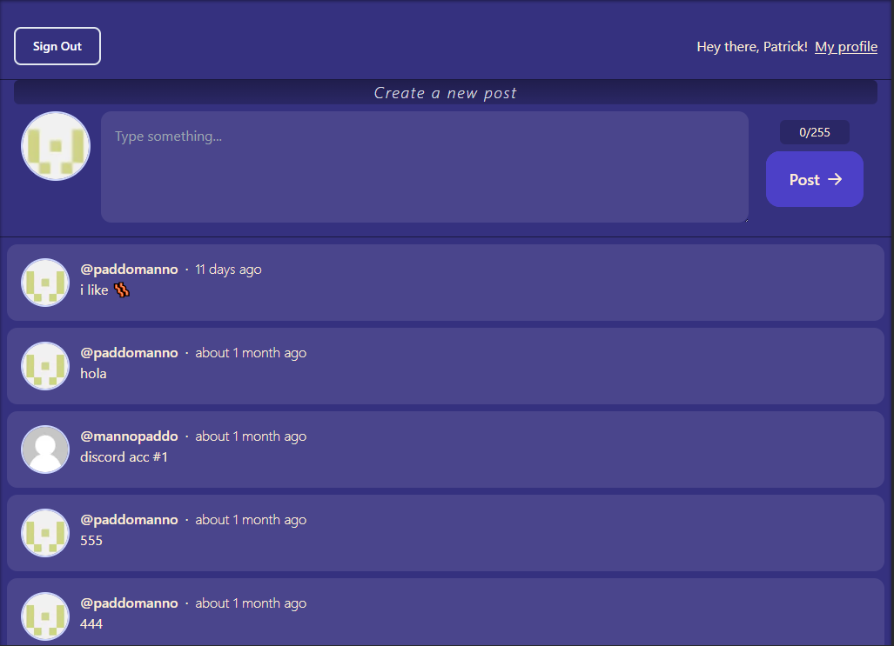

# Twitter Clone

A full-stack web application built with Next.js 13, Typescript, tRPC, Prisma, Planetscale DB, Clerk for Auth, and Axiom for Logging. This project allows users to write tweets and see a feed of other tweets or tweets by a specific user.

Credits to Theo for this great [tutorial](https://www.youtube.com/watch?v=YkOSUVzOAA4).

## Tech Stack

This is a [T3 Stack](https://create.t3.gg/) project bootstrapped with `create-t3-app`.

- [Next.js 13](https://nextjs.org)
- Typescript
- [NextAuth.js](https://next-auth.js.org)
- [Prisma](https://prisma.io)
- [Tailwind CSS](https://tailwindcss.com)
- [tRPC](https://trpc.io)
- Clerk for Auth
- Axiom for Logging

## Screenshot

## Note

- There is no live demo hosted at the moment.
- The project is currently unmaintained and not working due to an error with the Clerk service it uses.

## Description

The app requires users to sign in via GitHub or Discord using Clerk, an external service that provides user authentication. With Clerk, the app can authenticate users quickly and securely, without having to handle sensitive user information directly.

## TODO

- use react hook form to handle input state
- add infinite query / pagination instead of hardcoded 100 posts
- model User in db schema to synchronize with Clerk, not have to call Clerk's services
- embed support with Vercel OG image generation
